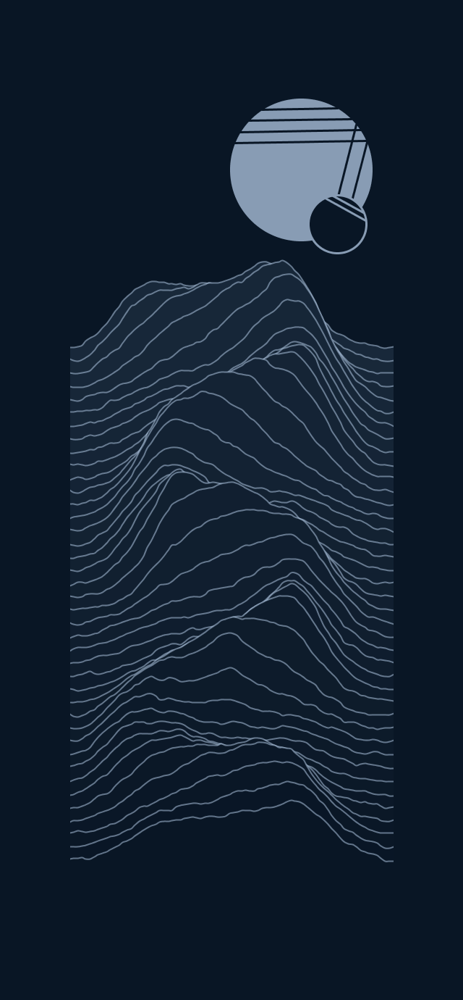
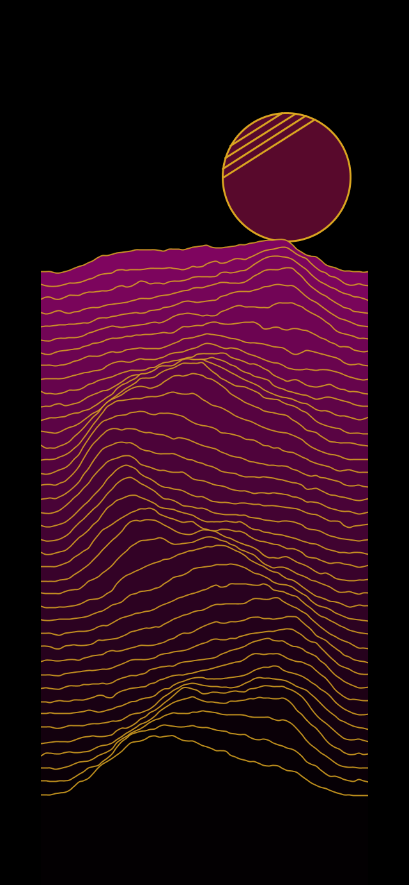
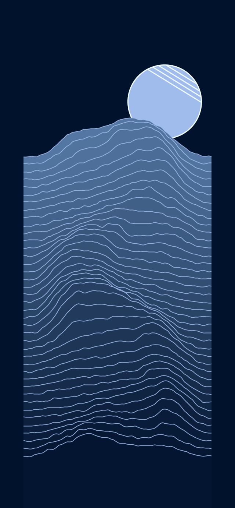
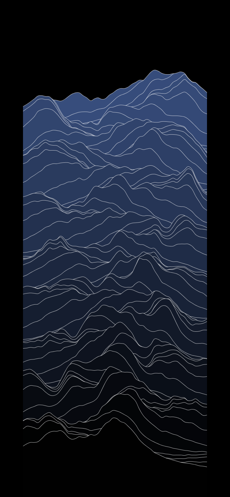
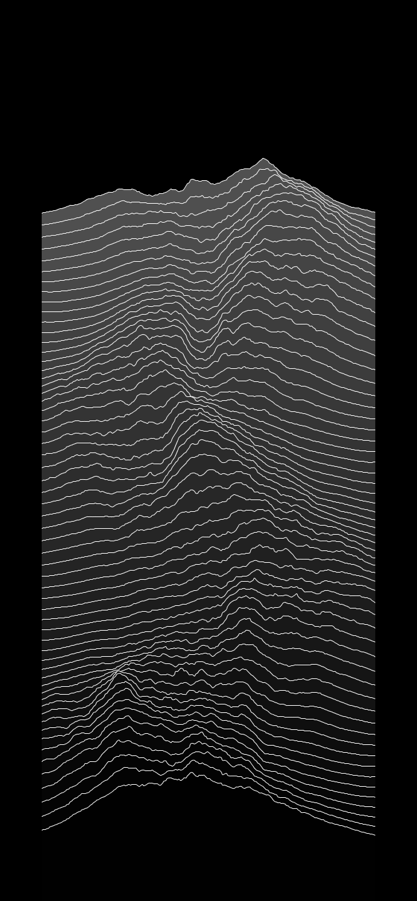
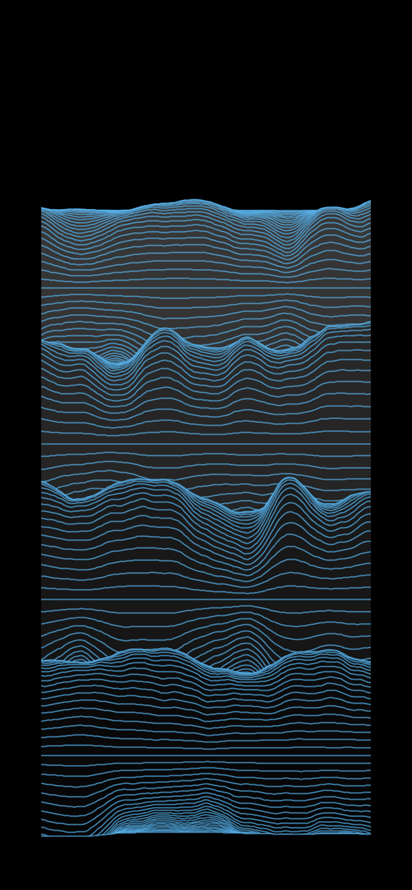
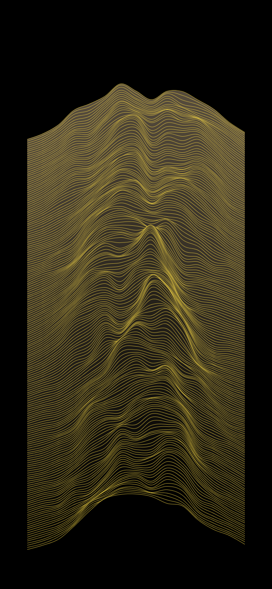
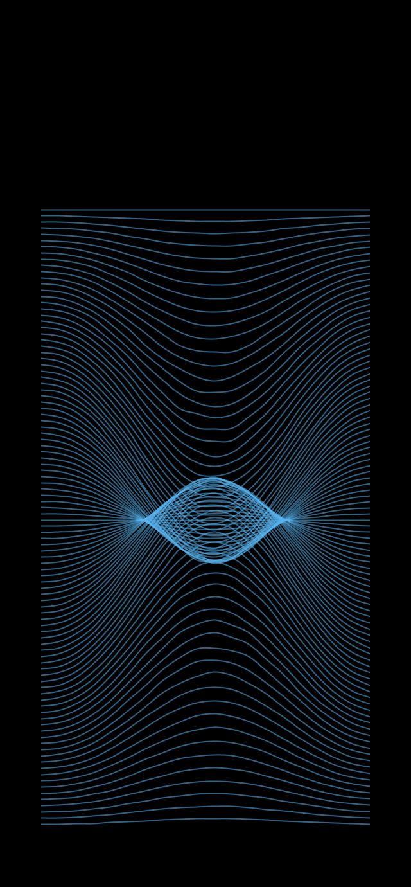
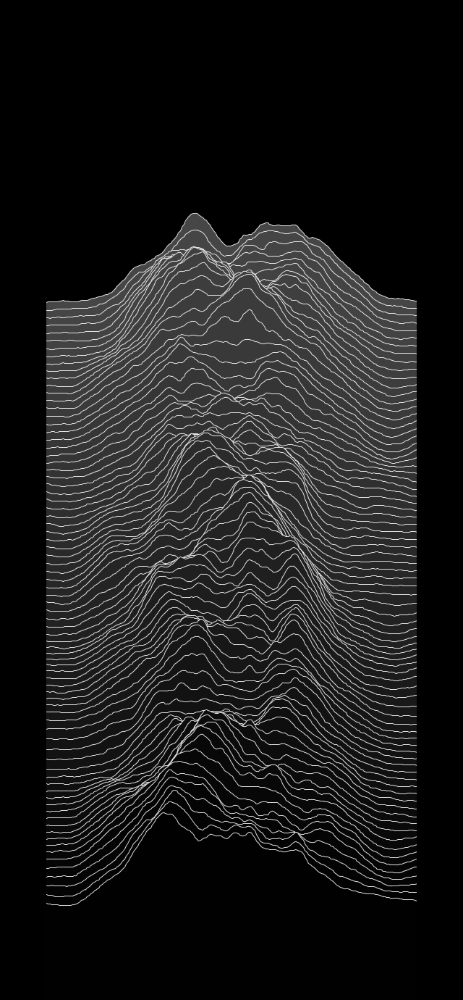

<h1>Procedural Pulsar Signal</h1>

## What's this

Personal project to generate column of procedural lines, from noise data. And little fancy suns over it.

Inspired from stuff like the representation of Pulsars radio signals, the album cover of 'Joy Division', and other similar project like [this](https://www.radiox.co.uk/artists/joy-division/cover-joy-division-unknown-pleasures-meaning/).

## Example of Generated Arts

    
    
    

    
    
    

    
    
    

## How it works

Generate a noise map using Perlin Noise and lot of extra filters to customize it : Octaves, multipliers based on current point's height, width, ect...
- There isn't much parameters for the noise map, you mostly have to hardcode changes and try out new stuff.

Then renders them on the screen using customizable parameters :
- Number of lines, Colors, Strokes weights, opacity... 

## Controls

- Press 's' to Save the current generate image as a .png file.
- Scroll with the mouse to vertically scroll the rendered noise map.
- Click on the mouse to pick a new seed and randomize again the generated lines. Uses height so must move the mouse between clicks.
